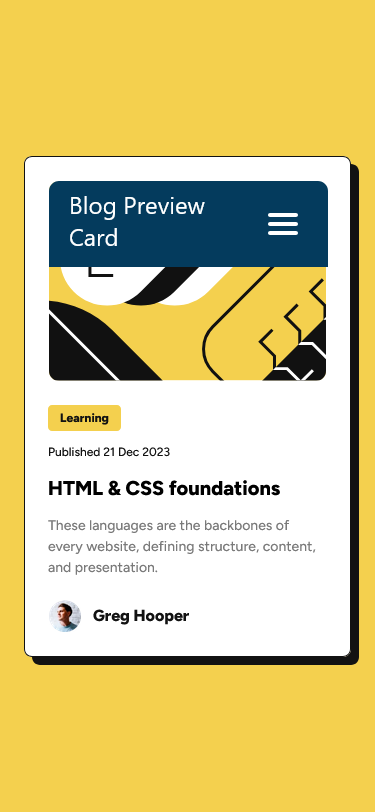
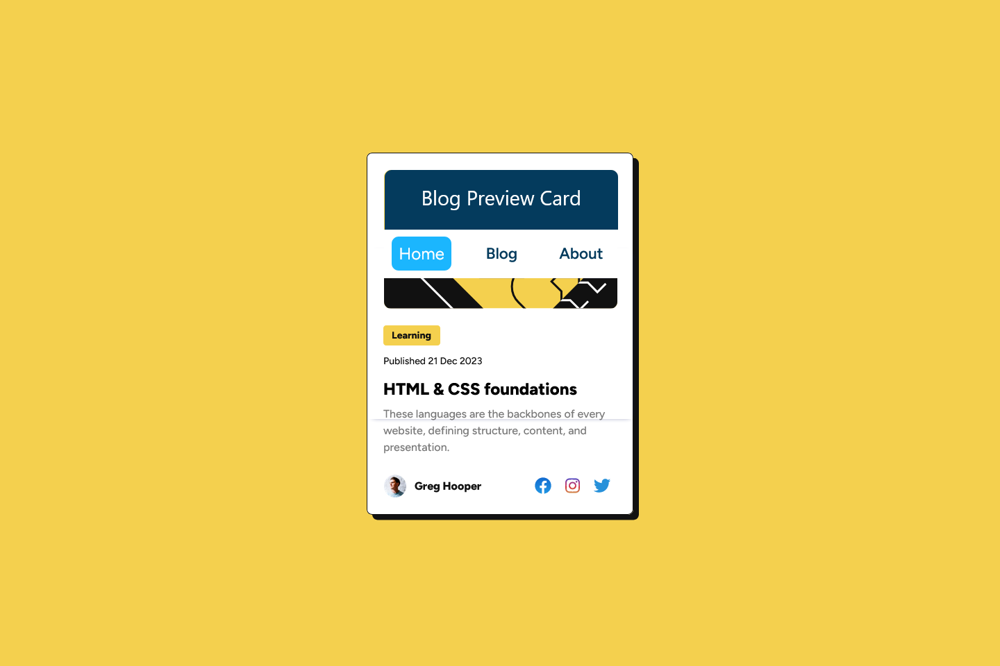

# Frontend Mentor - Blog preview card solution

This is a solution to the [Blog preview card challenge on Frontend Mentor](https://www.frontendmentor.io/challenges/blog-preview-card-ckPaj01IcS). Frontend Mentor challenges help you improve your coding skills by building realistic projects. 

## Table of contents

- [Overview](#overview)
  - [The challenge](./design/mobile-design.jpg)
  - [The challenge](./design/desktop-design.jpg)
  - [The challenge](./design/active-states.jpg)
  - [Screenshot](./assets/images/Screenshot_Mobile.png)
  - [Screenshot](./assets/images/Screenshot_Desktop.png)
  - [Links](https://ghikmet.github.io/blog-preview-card/)
- [My process](#my-process)
  - [Built with](Semantic HTML5 markup, BEM Methodology, CSS custom properties, Flexbox, Mobile-first workflow)
  - [What I learned](#what-i-learned)
  - [Continued development](First of all, I want to master my CSS skills.)
  - [Useful resources](#useful-resources)
- [Author](#author)
- [Acknowledgments](#acknowledgments)

**Note: Delete this note and update the table of contents based on what sections you keep.**

## Overview

### The challenge

Users should be able to:

- See hover and focus states for all interactive elements on the page

### Screenshot




### Links

- Solution URL: [Add solution URL here](https://your-solution-url.com)
- Live Site URL: [Add live site URL here](https://ghikmet.github.io/blog-preview-card/)

## My process

### Built with

- Semantic HTML5 markup
- CSS custom properties
- Flexbox
- Mobile-first workflow

### What I learned

Use this section to recap over some of your major learnings while working through this project. Writing these out and providing code samples of areas you want to highlight is a great way to reinforce your own knowledge.

To see how you can add code snippets, see below:

```html
<h1>Some HTML code I'm proud of</h1>
```
```css
.proud-of-this-css {
  color: papayawhip;
}
```
```js
const proudOfThisFunc = () => {
  console.log('🎉')
}
```

If you want more help with writing markdown, we'd recommend checking out [The Markdown Guide](https://www.markdownguide.org/) to learn more.

**Note: Delete this note and the content within this section and replace with your own learnings.**

### Continued development

First of all, I want to master my CSS skills.

### Useful resources

- [Example resource 1](https://en.bem.info/methodology/) - This helped me to use BEM Methodology.
- [Example resource 2](https://www.youtube.com/watch?v=x4u1yp3Msao) - This Youtube video "A practical guide to responsive web design" created by Kevin Powel helped me to create responsive website.

## Author

- Website - [Add your name here](https://ghikmet.github.io/blog-preview-card/)
- Frontend Mentor - [@yourusername](https://www.frontendmentor.io/profile/ghikmet)

## Acknowledgments

I want to thank 2 YouTubers - Kevin Powel and Brad Travesy, whose channels I visit from time to time and watch their great and very useful videos that help me in studying Frontend Web Development.
